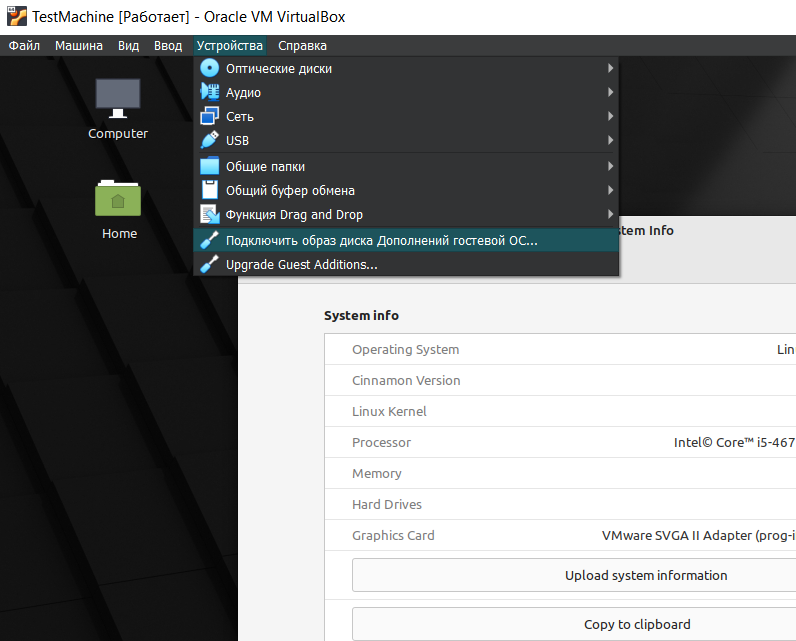
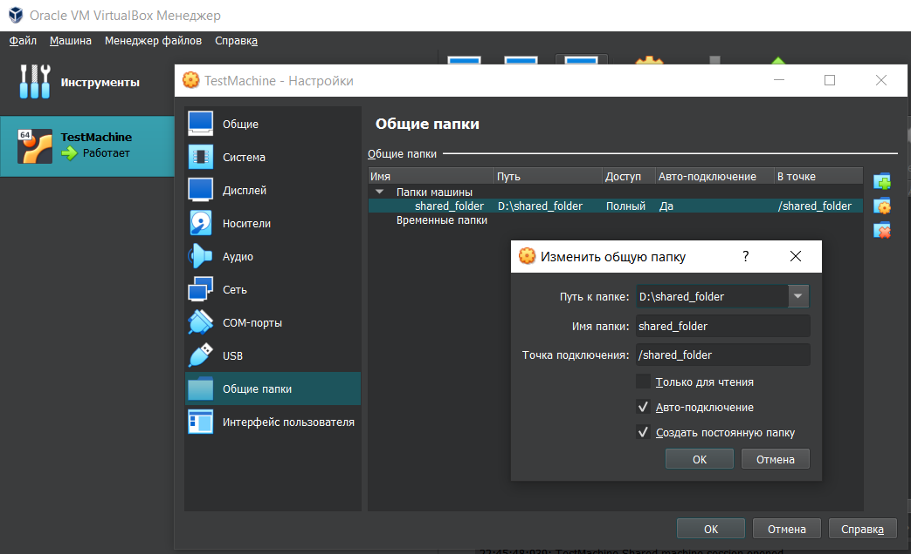

# Удобная отладка и разработка

Неудобно отлаживать такое приложение на двух компьютерах объединённых в локальную сеть. Все же лучше будет воспользоваться технологиями виртуализации, которые может предоставить, например, программа VirtualBox. В качестве гостевой ОС я выбрал Linux Mint 21 Cinnamon.
Какая гостевая машина ни была бы выбрана, её потребуется настроить.

В настройки можно попасть несколькими способами, на картинке ниже представлен один из них (**Устройства** -> **Сеть** -> **Настроить сеть...**):

На вкладке **Сеть** для параметра **Тип подключения** надо выбрать **Сетевой мост**. Таким образом, виртуальная сетевая карта получит адрес из пула адресов реальной физической локальной сети, к которой подключен и ваш реальный компьютер.

Затем нужно добиться того, чтобы папка хостевой ОС, в которой будут лежать исходники LAN-DESKTOP, смонтировалась в файловой системе гостевой ОС, и таким образом можно будет избавить себя от постоянного копирования исходников программы из хостевой ОС в гостевую ОС после внесении изменений в эти исходники при отладке и разработке.

Начать следует с подключения **образа диска Дополнений гостевой ОС** через меню **Устройства**:

После выполнения этой команды на рабочем столе должен смонтироваться сидюшник и установка должна будет запуститься автоматически, перед этим ОС спросит, нужно ли её начинать именно сейчас:

Установка может занять минут пять и после неё надо будет перезагрузить гостевую ОС.

Затем в настройках машины надо попасть в раздел **Общие папки**, через меню (**Устройства** -> **Общие папки** -> **Настроить общие папки...**)

Затем надо добавить и настроить общую папку в разделе **Общие папки**:

Ещё раз перезагружаем гостевую ОС. Расшаренная папка может быть недоступна в точке подключения и/или придётся без конца вводить пароль пользователя, и чтобы избежать этой рутины, нужно выполнить следующую команду в консоли:

`sudo gpasswd -a [your-user-name] vboxsf`

[your-user-name] - имя пользователя без квадратных скобок. Для того, чтобы эти изменения вступили в силу, нужно ещё раз перезагрузить гостевую ОС.

В итоге всех этих манипуляций, можно будет найти общую папку в корне файловой системы гостевой ОС:

