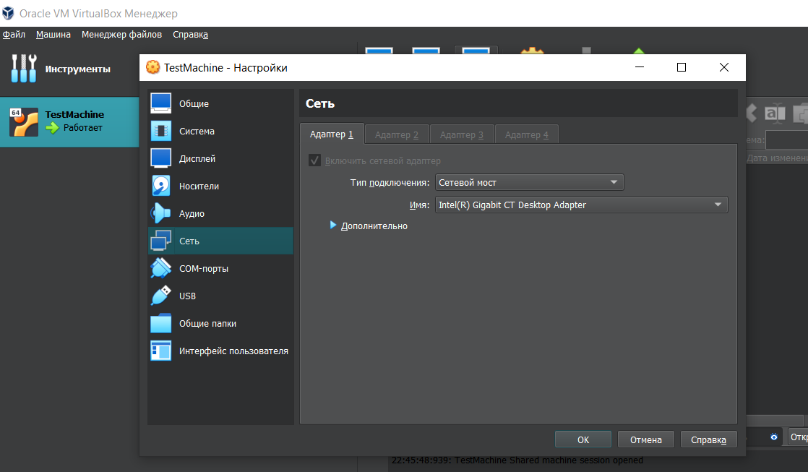

# [Russian] LAN-DESKTOP Explorer v0.1 for Windows by Sergei Krumas [PyQt]

LAN-DESKTOP Explorer в пределах локальной сети позволяет как управлять удалённым компьютером, так и позволить удалённому компьютеру управлять вашим компьютером.

Готовая альтернатива, на которую можно периодически посматривать и брать идейки для дальнейшей разработки: https://github.com/topics/remote-desktop?l=python

## Changelog

### 1й раунд разработки (август 2023 - 13 февраля 2024)
- добавлен чат из примеров Qt, который я портировал на PyQt. В процессе пришлось отказаться от QCBORStreamWriter и QCBORStreamReader и воспользоваться модулем cbor2, так как питоновская обёртка QCBORStreamWriter не поддерживает передачу строк, а cbor2 работает как модуль json.
	- на основе этого чата будет разрабатываться LAN-DESKTOP
	- помимо отправки сообщений в пределах локальной сети чат умеет искать пиров и сообщает об их подключении как только так сразу

### 2й раунд разработки (13 февраля 2024 - ?????)

## Второстепенные хотелки
- показывать на удалённом компьютере нажимаемые и зажимаемые клавиши
- передавать видео с видеокамеры и голос с микрофона или видеокамеры
- проверка обновлений в репозитории при загрузке или обновление от соседа, который подключается (решить проблему автоматической установки новых зависимостей, если они появятся)

## Отладка
Неудобно отлаживать такое приложение на двух компьютерах объединённых в локальную сеть. Все же лучше будет воспользоваться технологиями виртуализации, которые может предоставить, например, программа VirtualBox. В качестве гостевой ОС я выбрал Linux Mint 21 Cinnamon.
Какая гостевая машина ни была бы выбрана, её надо настроить.

На вкладке **Сеть** для параметра **Тип подключения** надо выбрать **Сетевой мост**. Таким образом, виртуальная сетевая карта получит адрес из пула адресов реальной физической локальной сети, к которой подключен и ваш реальный компьютер.

Затем нужно добиться того, чтобы папка хостевой ОС, в которой будут лежать исходники LAN-DESKTOP, смонтировалась в файловой системе гостевой ОС, и таким образом можно будет избавить себя от постоянного копирования исходников программы из хостевой ОС в гостевую ОС после внесении изменений в эти исходники при отладке и разработке.

Начать следует с подключения **образа диска Дополнений гостевой ОС** через меню **Устройства**:

После выполнения этой команды на рабочем столе должен смонтироваться сюдюшник и установка должна будет запуститься автоматически, перед этим ОС спросит, нужно ли её начинать именно сейчас

Установка может занять минут пять и после неё надо будет перезагрузить гостевую ОС.

Затем в настройках (в том же окне, где мы настраивали сеть) надо настроить общую папку в разделе **Общие папки**.

Ещё раз перезагружаем гостевую ОС. Расшаренная папка может быть недоступна в точке подключения и/или придётся без конца вводить пароль пользователя, и чтобы избежать этой рутины, нужно выполнить следующую команду в консоли:

`sudo gpasswd -a [your-user-name] vboxsf`

[your-user-name] - имя пользователя без квадратных скобок. Для того, чтобы эти изменения вступили в силу, нужно ещё раз перезагрузить гостевую ОС.

В итоге всех этих манипуляций, можно будет найти общую папку в корне файловой системы гостевой ОС:

## Если не работает
Файерволл (брандмауэр) может блокировать исходящие и входящие подключения для LAN-DESKTOP, поэтому возможно придётся подредактировать правила фаерволла, или для начала полностью его выключить, чтобы убедится, что причина в нём. При первом обращении LAN-DESKTOP и вообще любого другого python-скрипта к сети, Windows спросит пользователя дозволено ли будет процессу `python.exe` иметь сетевые подключения. Это происходит лишь один раз, и если вы прошляпили этот момент, то всегда можно поправить это дело в файерволе. LAN-DESKTOP использует как TCP, так и UDP.

В случае, если в системе установлено несколько интерпретаторов Python, то при задании правил для входящих подключений в брандмауэре можно опрделить путь до нужного экзешника-интерпретатора запустив в консоли скрипт:
`import sys
print(sys.executable)
`

